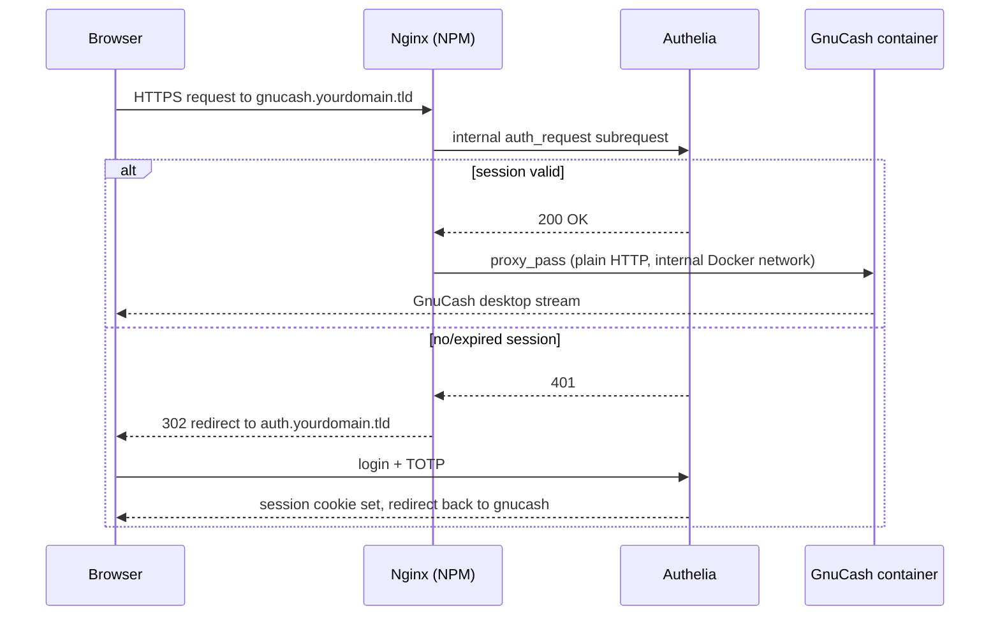

# docker-gnucash

[GnuCash](https://www.gnucash.org/) running as a full desktop application inside your browser — no local install required.

This is a fork of [linuxserver/docker-calibre](https://github.com/linuxserver/docker-calibre), retargeted from Calibre to GnuCash. It builds on [`ghcr.io/linuxserver/baseimage-selkies`](https://github.com/linuxserver/docker-baseimage-selkies), which streams a real Linux desktop to your browser over WebRTC/websockets (via [Selkies](https://github.com/selkies-project/selkies)), so GnuCash runs exactly as it would on a desktop — just accessed at a URL instead of a window.

This is a personal build, not an official LinuxServer.io or GnuCash project.

## Quick start

There's no published image yet — build it locally:

```bash
git clone https://github.com/theblaz/docker-gnucash.git
cd docker-gnucash
docker build -t docker-gnucash .
```

### docker-compose

```yaml
---
services:
  gnucash:
    image: docker-gnucash
    container_name: gnucash
    security_opt:
      - seccomp:unconfined #optional, see Security note below
    environment:
      - PUID=1000
      - PGID=1000
      - TZ=Etc/UTC
      - PASSWORD= #optional
      - CLI_ARGS= #optional, e.g. path to a .gnucash file to open on startup
    volumes:
      - /path/to/gnucash/config:/config
    ports:
      - 8080:8080
      - 8181:8181
    shm_size: "1gb"
    restart: unless-stopped
```

### docker cli

```bash
docker run -d \
  --name=gnucash \
  --security-opt seccomp=unconfined `#optional` \
  -e PUID=1000 \
  -e PGID=1000 \
  -e TZ=Etc/UTC \
  -e PASSWORD= `#optional` \
  -e CLI_ARGS= `#optional` \
  -p 8080:8080 \
  -p 8181:8181 \
  -v /path/to/gnucash/config:/config \
  --shm-size="1gb" \
  --restart unless-stopped \
  docker-gnucash
```

Once running, open `https://yourhost:8181/` — GnuCash will already be open and maximized on the desktop.

## Parameters

| Parameter | Function |
| :----: | --- |
| `-p 8080:8080` | desktop GUI (HTTP, only useful behind a reverse proxy) |
| `-p 8181:8181` | desktop GUI (HTTPS) |
| `-e PUID=1000` | UserID — see [User / Group Identifiers](#user--group-identifiers) |
| `-e PGID=1000` | GroupID — see [User / Group Identifiers](#user--group-identifiers) |
| `-e TZ=Etc/UTC` | timezone, see this [list](https://en.wikipedia.org/wiki/List_of_tz_database_time_zones#List) |
| `-e PASSWORD=` | optional HTTP basic auth password for the `abc` user |
| `-e CLI_ARGS=` | optional args passed straight to `gnucash`, e.g. a file path to open a book on startup |
| `-v /config` | persistent home directory — GnuCash preferences live in `/config/.config/gnucash`; **save your book files somewhere under `/config`** (e.g. `/config/Documents`) so they survive container recreation |
| `--shm-size=` | recommended for all desktop/selkies-based images |
| `--security-opt seccomp=unconfined` | some GUI syscalls aren't in Docker's default seccomp profile; see [Security note](#security-note) before using this |

This image is built on `baseimage-selkies`, which supports a large set of additional environment variables (GPU acceleration, Wayland tuning, UI hardening, watermarking, etc.) — see the [baseimage-selkies README](https://github.com/linuxserver/docker-baseimage-selkies) for the full list. `TITLE` defaults to `GnuCash` in this image.

## Security note

> [!WARNING]
> This container provides privileged access to the host system. Do not expose it to the Internet unless you have secured it properly.

- HTTPS is required for full functionality — connect via port `8181`, not `8080`.
- There is no authentication by default. `PASSWORD` enables basic HTTP auth, which is only suitable for a trusted local network. For internet exposure, put this behind a reverse proxy (e.g. [SWAG](https://github.com/linuxserver/docker-swag)) with real authentication.
- The web desktop includes a terminal with passwordless `sudo`. Anyone with GUI access has root in the container.
- `--security-opt seccomp=unconfined` disables a Docker security layer. Only use it if GnuCash fails to start without it (older kernels/libseccomp).

## Securing Remote Access with Authelia

By default this image has no authentication of its own beyond the optional `PASSWORD` basic-auth variable, which the Security note above already flags as only suitable for a trusted local network. If you're exposing GnuCash to the internet, put it behind a reverse proxy that handles real authentication first — this section documents a working setup using [Authelia](https://www.authelia.com/) in front of [Nginx Proxy Manager](https://nginxproxymanager.com/) (NPM), with TOTP two-factor login.

This is one way to do it, tested against this image specifically. It assumes:

- NPM is already reverse-proxying other services on your domain with a working TLS certificate (this guide was written against a DuckDNS wildcard cert, but any ACME setup works the same way).
- You're comfortable editing `docker-compose.yml` files and running `docker compose` / `docker exec`.
- You want Authelia guarding *only* this container for now — every other service you run keeps whatever auth it already has.

### How it works

Nginx pauses each request to `gnucash.yourdomain.tld`, asks Authelia (over an internal subrequest) whether the visitor has a valid session, and either forwards to the container or bounces the browser to Authelia's login/TOTP page first.



Because only the `gnucash` proxy host in NPM gets wired up to check with Authelia, `default_policy: deny` in Authelia's config never touches any other service you run.

### 1. Put this container on the same Docker network as NPM and Authelia

NPM needs to reach both this container and Authelia by container name, so all three need to share a Docker network:

```yaml
services:
  gnucash:
    image: docker-gnucash
    container_name: gnucash
    environment:
      - PUID=5000
      - PGID=5000
      - TZ=America/Edmonton
      # - PASSWORD=...          # leave unset — Authelia is now the login, no need to stack a second prompt in front of it
      - RESTART_APP=true
    volumes:
      - /srv/appdata/docker-gnucash:/config
    ports:
      - 2828:8080
      - 2929:8181
    shm_size: 1gb
    restart: unless-stopped
    networks:
      - your_proxy_network       # same network NPM and Authelia are on

networks:
  your_proxy_network:
    external: true
```

Point NPM's proxy host at the container's **internal HTTP port, 8080** — not the `2828` host mapping (only relevant for direct LAN access), and not `8181`/`2929`, which is the self-signed HTTPS port. NPM already terminates real TLS for your public domain; the internal hop to this container should stay plain HTTP on the private Docker network.

> **Note on `RESTART_APP`:** if you see a "this file may already be open" lock warning after reconnecting, it's likely because the container's auto-restart is force-relaunching GnuCash rather than letting it exit cleanly, which can leave a stale lock file behind. If that happens regularly, try setting `RESTART_APP=false` and instead close GnuCash from inside the app (its own Quit/close flow) before it goes idle, then relaunch it from the desktop's right-click menu when needed — that routes every exit through GnuCash's normal shutdown, which releases the lock properly.

### 2. Deploy Authelia

On your Docker host, next to your other stacks:

```bash
mkdir -p authelia/config authelia/secrets authelia/data
cd authelia

openssl rand -base64 32 | tr -d '\n' > secrets/JWT_SECRET
openssl rand -base64 32 | tr -d '\n' > secrets/SESSION_SECRET
openssl rand -base64 32 | tr -d '\n' > secrets/STORAGE_ENCRYPTION_KEY
chmod 600 secrets/*
```

Authelia also needs to send real email, both to confirm your identity before registering a 2FA device and for password resets. With Gmail, generate an [App Password](https://myaccount.google.com/apppasswords) (requires 2-Step Verification) and save it the same way, with no spaces:

```bash
echo -n 'your16charapppassword' > secrets/SMTP_PASSWORD
chmod 600 secrets/SMTP_PASSWORD
```

`authelia/docker-compose.yml`:

```yaml
services:
  authelia:
    container_name: authelia
    image: authelia/authelia:latest
    restart: unless-stopped
    networks:
      - your_proxy_network
    environment:
      AUTHELIA_IDENTITY_VALIDATION_RESET_PASSWORD_JWT_SECRET_FILE: /secrets/JWT_SECRET
      AUTHELIA_SESSION_SECRET_FILE: /secrets/SESSION_SECRET
      AUTHELIA_STORAGE_ENCRYPTION_KEY_FILE: /secrets/STORAGE_ENCRYPTION_KEY
      AUTHELIA_NOTIFIER_SMTP_PASSWORD_FILE: /secrets/SMTP_PASSWORD
      TZ: America/Edmonton
    volumes:
      - ./config:/config
      - ./secrets:/secrets
      - ./data:/data

networks:
  your_proxy_network:
    external: true
```

`authelia/config/configuration.yml`:

```yaml
server:
  address: 'tcp://:9091'

log:
  level: 'info'

theme: 'auto'

authentication_backend:
  file:
    path: '/config/users_database.yml'

access_control:
  default_policy: 'deny'
  rules:
    - domain: 'auth.yourdomain.tld'
      policy: 'bypass'
    - domain: 'gnucash.yourdomain.tld'
      policy: 'two_factor'

session:
  cookies:
    - domain: 'yourdomain.tld'
      authelia_url: 'https://auth.yourdomain.tld'
      default_redirection_url: 'https://gnucash.yourdomain.tld'   # must differ from authelia_url or Authelia refuses to start

regulation:
  max_retries: 3
  find_time: '2m'
  ban_time: '15m'

storage:
  local:
    path: '/data/db.sqlite3'

notifier:
  smtp:
    address: 'submission://smtp.gmail.com:587'
    username: 'youraddress@gmail.com'
    sender: '"Authelia" <youraddress@gmail.com>'
    subject: '[Authelia] {title}'
    startup_check_address: 'youraddress@gmail.com'
    identifier: 'yourdomain.tld'
```

The four secrets referenced via `..._FILE` environment variables in the compose file above are picked up automatically — nothing in `configuration.yml` needs to reference `secrets/` directly.

Create your first account by generating a password hash (this runs entirely locally):

```bash
docker run --rm authelia/authelia:latest authelia crypto hash generate argon2 --password 'your-real-password'
```

The output is prefixed with `Digest: ` — copy only the part starting at `$argon2id$...`.

`authelia/config/users_database.yml`:

```yaml
users:
  yourusername:
    displayname: 'Your Name'
    password: '$argon2id$...paste the generated hash here...'
    email: 'you@example.com'
    groups:
      - 'admins'

groups:
  admins:
    - 'yourusername'
```

Start it:

```bash
cd authelia
docker compose up -d
docker logs -f authelia
```

### 3. Configure Nginx Proxy Manager

**Auth portal host** — add a new Proxy Host for `auth.yourdomain.tld`, forwarding to `authelia` on port `9091`, using your existing wildcard/domain certificate.

**Nginx snippets** — the forward-auth check needs four small include files, mounted read-only into the NPM container at `/snippets/`:

```bash
# next to your NPM compose file
mkdir -p npm-snippets
```

`npm-snippets/authelia-location.conf`:
```nginx
set $upstream_authelia http://authelia:9091/api/authz/auth-request;

location /internal/authelia/authz {
    internal;
    proxy_pass $upstream_authelia;

    proxy_set_header X-Original-Method $request_method;
    proxy_set_header X-Original-URL $scheme://$host$request_uri;
    proxy_set_header X-Forwarded-For $remote_addr;
    proxy_set_header Content-Length "";
    proxy_set_header Connection "";

    proxy_pass_request_body off;
    proxy_next_upstream error timeout invalid_header http_500 http_502 http_503;
    proxy_redirect http:// $scheme://;
    proxy_http_version 1.1;
    proxy_cache_bypass $cookie_session;
    proxy_no_cache $cookie_session;
    proxy_buffers 4 32k;
    client_body_buffer_size 128k;

    send_timeout 5m;
    proxy_read_timeout 240;
    proxy_send_timeout 240;
    proxy_connect_timeout 240;
}
```

`npm-snippets/authelia-authrequest.conf`:
```nginx
auth_request /internal/authelia/authz;

auth_request_set $user $upstream_http_remote_user;
auth_request_set $groups $upstream_http_remote_groups;
auth_request_set $name $upstream_http_remote_name;
auth_request_set $email $upstream_http_remote_email;

proxy_set_header Remote-User $user;
proxy_set_header Remote-Groups $groups;
proxy_set_header Remote-Email $email;
proxy_set_header Remote-Name $name;

auth_request_set $redirection_url $upstream_http_location;
error_page 401 =302 $redirection_url;
```

`npm-snippets/proxy.conf`:
```nginx
proxy_set_header Host $host;
proxy_set_header X-Original-URL $scheme://$host$request_uri;
proxy_set_header X-Forwarded-Proto $scheme;
proxy_set_header X-Forwarded-Host $host;
proxy_set_header X-Forwarded-URI $request_uri;
proxy_set_header X-Forwarded-Ssl on;
proxy_set_header X-Forwarded-For $remote_addr;
proxy_set_header X-Real-IP $remote_addr;

client_body_buffer_size 128k;
proxy_next_upstream error timeout invalid_header http_500 http_502 http_503;
proxy_redirect http:// $scheme://;
proxy_http_version 1.1;
proxy_cache_bypass $cookie_session;
proxy_no_cache $cookie_session;
proxy_buffers 64 256k;

send_timeout 5m;
proxy_read_timeout 360;
proxy_send_timeout 360;
proxy_connect_timeout 360;
```

`npm-snippets/websocket.conf`:
```nginx
proxy_set_header Upgrade $http_upgrade;
proxy_set_header Connection "upgrade";
```

This image's Selkies-based desktop streams over a WebSocket connection. NPM's built-in "Websockets Support" toggle normally adds these headers for you, but it injects them into NPM's auto-generated location block — which the custom `location /` block below replaces entirely. Without this file the page loads but you'll see "Websocket disconnected, attempting to reconnect."

Mount the folder into NPM and restart it:

```yaml
# NPM's docker-compose.yml
    volumes:
      - ./npm-snippets:/snippets:ro
      # ...your existing volumes stay as they are
```

```bash
docker compose up -d
```

**gnucash proxy host** — open your existing proxy host for `gnucash.yourdomain.tld`, go to the **Advanced** tab, and paste:

```nginx
include /snippets/authelia-location.conf;

location / {
    include /snippets/proxy.conf;
    include /snippets/websocket.conf;
    include /snippets/authelia-authrequest.conf;
    proxy_pass http://gnucash:8080;
}
```

Save — NPM regenerates the Nginx config for this host only.

### 4. First login

Visit `https://gnucash.yourdomain.tld`. You'll be redirected to `auth.yourdomain.tld`; log in, then go to Settings → One-Time Password → Add. Authelia emails a confirmation link before letting you register a 2FA device — click it, then scan the QR code with an authenticator app.

If you're doing this from the same phone that's showing the QR code, you obviously can't scan it with that phone's own camera. Look for a small "can't scan?" link or icon near the QR code that reveals a plain-text setup key instead, and use your authenticator app's "enter a setup key manually" option.

### 5. Logging out

GnuCash itself has no concept of the Authelia session sitting in front of it, so closing the tab doesn't log you out — the session cookie persists (by default, up to 1 hour, or 5 minutes of inactivity). To end it explicitly, visit `https://auth.yourdomain.tld/logout`, or use the account menu on the Authelia portal itself. Worth bookmarking that URL as a home-screen icon on mobile for a one-tap logout.

## Known limitation: in-app Help

GnuCash's Help menu opens `yelp`, which renders pages via WebKitGTK. WebKitGTK sandboxes its renderer process using `bubblewrap`, which needs to mount a nested `/proc`. Most Docker hosts strip the capability (`CAP_SYS_ADMIN`) required for that by default, so **Help currently does not open** in this image. Granting `--cap-add=SYS_ADMIN` fixes it but weakens container isolation, so it isn't done here — the docs (`gnucash-docs`) are still installed and readable directly at `/usr/share/help/C/gnucash-guide` and `/usr/share/help/C/gnucash-manual` inside the container if needed, or read online at [gnucash.org/docs.phtml](https://www.gnucash.org/docs.phtml).

## User / Group Identifiers

When using volumes (`-v`), permission mismatches between the host and container are avoided by setting `PUID`/`PGID` to match a host user:

```bash
id your_user
```

```text
uid=1000(your_user) gid=1000(your_user) groups=1000(your_user)
```

## Building locally

```bash
git clone https://github.com/theblaz/docker-gnucash.git
cd docker-gnucash
docker build --no-cache --pull -t docker-gnucash .
```

An `aarch64` variant is provided as `Dockerfile.aarch64` (inherited from the upstream Calibre fork; not verified against GnuCash).

## Credits

- Based on [linuxserver/docker-calibre](https://github.com/linuxserver/docker-calibre) and [linuxserver/docker-baseimage-selkies](https://github.com/linuxserver/docker-baseimage-selkies).
- [GnuCash](https://www.gnucash.org/) is developed by the GnuCash project.
- Not affiliated with or endorsed by LinuxServer.io or the GnuCash project.

## License

Inherited from the upstream fork: [GPLv3](LICENSE).
